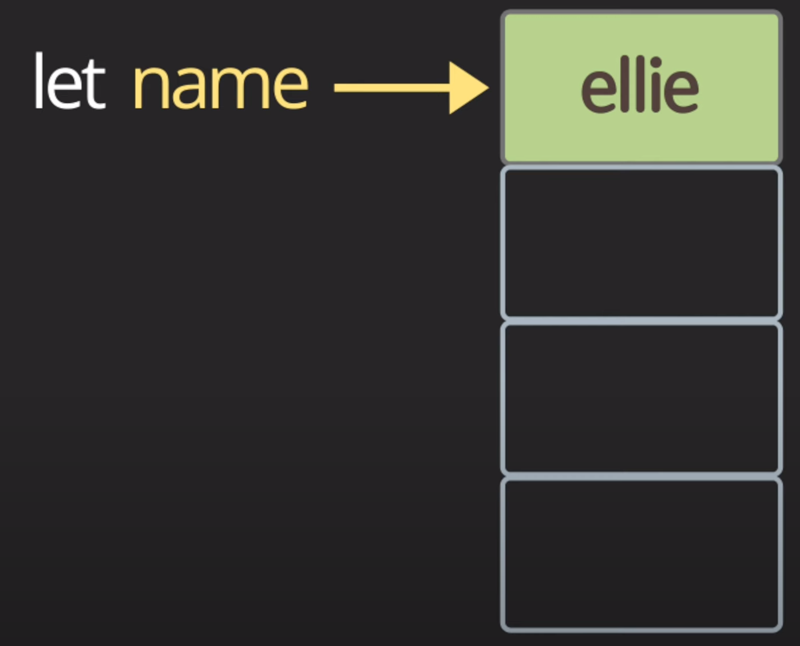
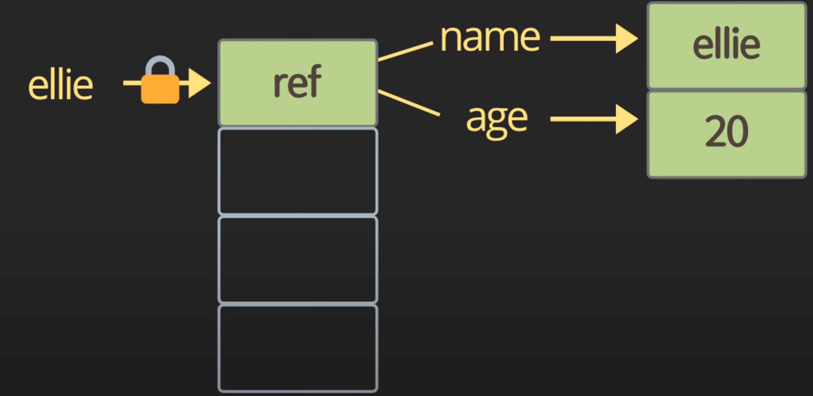

# js_summary03

## primitive & object & memory
메모리에 값이 저장되는 방법에는 두가지가 있다. `primitive type`인지, `objective type`인지에 따라 메모리에 다른 방식으로 저장된다.

* `primitive` type의 경우, value, 값 자체가 메모리에 저장된다.

    

* `object`는 커서 메모리에 한번에 다 올라갈 수가 없다.

  
    object는 object를 가리키는 reference가 메모리에 저장된다.

### mutable & immutable data types

Mutable data types : `all objects by default are mutable in JS`

e.g. `array`, objects...
 
Immutable data types : `primitive types`, `frozen objects`

> 다른 언어에서는 mutable array와 immutable array가 따로 존재하는 경우도 있다. 
> 
> 자바스크립트에서는 대부분은 object는 mutation이 가능하다.

reference : dorm_study/`primitive_vs_reference`

---

## operator 💬

### Logical operator ⚠️

* or 연산자 (||) 사용시, `simple한 value들을 앞으로 배치`하고, `복잡한 value들을 뒤로 배치하자`.⚠️
```js
const value1 = true;
const value2 = 2 < 4;

console.log(`or: ${value1 || value2 || check()}`);

function check() {
    for (let i = 0; i < 10; i++) {
        console.log('😎');
    }
    return true;
}
```
* and 연산자 (&&) 또한 위와 마찬가지다.

`and는 간편하게 null 체크를 할 때에도 많이 쓰인다.` ⚠️

```js
const nullableObject = {aa: '11', bb: '22'};

nullableObject && nullableObject.bb 
```

위와같은 표기방법을 통해 nullableObject가 null인지 아닌지 확인할 수 있다.

위와 아래 코드는 같은 의미.

```js
if (nullableObject != null) {
    nullableObject.bb;
}
```

### Equality Operator ⚠️

```js
const StringFive = '5';
const numberFive = 5;

// == lose equality, with type conversion
console.log(StringFive == numberFive); //true
console.log(stringFive != numberFive); //false

// === strict equality, no type conversion
console.log(stringFive === numberFive); //false
console.log(stringFive !== numberFive); //true
```

자바스크립트 엔진은 문자열이더라도 number가 들어있으면, == 연산자를 이용하면 같다고 표현한다. type 변환이 일어난다.

하지만 ===연산자를 이용하면, 타입이 다른 경우 다른 것이라 판단한다. 

때문에 `웬만하면 ===연산자를 사용하자`!

```js
const ellie1 = { name: 'ellie' };
const ellie2 = { name: 'ellie' };
const ellie3 = ellie1;
console.log(ellie1 == ellie2); //false 
console.log(ellie1 === ellie2); //false
console.log(ellie1 === ellie3); //true

console.log(0 == false); // true
console.log(0 === false); // false, 0 isn't a boolean type
console.log('' == false); // true
console.log('' === false); // false, '' isn't a boolean type
console.log(null == undefined); // true ⚠️
console.log(null === undefined); // false ⚠️
```

### Conditional Operators: if

* if-else

* Ternary operator⚠️
  
  간단할 때만 사용하자. → 과 사용시 가독성 떨어짐
  
  `condition ? value1 : value2;`
  

* switch-case

  ```js
  const browser = 'IE';
  switch (browser) {
    case 'IE':
        console.log('go away');
        break;
    case 'Chrome':
    case 'Firefox':
        console.log('love you');
        break;
    default:
        console.log('same all!');
        break;
  }
  ```
  
### while loop

### do-while loop

### for-loop

 


    


