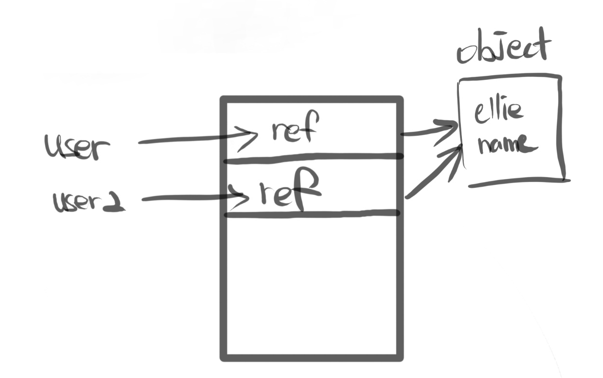

# js_summary06

## object ⚠️

```js
const name = 'ellie';
const age = 4;
print(name, age);

function print(name, age) {
  console.log(name);
  console.log(age);
}
``` 

위와같이 primitive 타입들을 출력하는 함수를 만든다고 가정하자. 이 때, 인자들이 많아지면 가각에 대한 처리도 추가해줘야 하기 때문에 번거롭고, 로지컬하게 고루고루 묶어서
생각하기 힘들기 때문에 힘들다.

```js
function print(person) {
  console.log(person.name);
  console.log(person.age);
}

const ellie = {
  name: 'ellie',
  age: 4,
};

print(ellie);
```

그런 문제점들 때문에 위와같이 object로 관리해 보다 간편하게 데이터를 관리할 수 있다.

### object를 만드는 방법 ⚠️

```js
const obj1 = {}; //'object literal' syntax

const obj2 = new Object(); //'object constructor' syntax
```

### object - dynamic typing ⚠️

javascript는 `dynamically typing language`이기 때문에, 동적으로 type이 runtime때 결정된다. 때문에 다음과 같은 행위가 가능해진다.⚠ ️

```js
const ellie = {
  name: 'ellie',
  age: 4,
};

ellie.hasJob = true;

delete ellie.hasJob;
```

하지만 너무 과하게 dynamic typing을 하면 유지보수가 굉장히 힘들어지고 생각지도 못한 에러가 발생할 수 있다.

또한, 특정 프로퍼티를 빼고 싶으면 위와같이 delete 키워드를 이용해 빼줄 수 있다.

### object = { key : value };

object는 key와 value의 집합체이다.

key : 우리가 접근할 수 있는 property

value : 그 key에 해당하는 값

## computed properties

key should be always string

### 프로퍼티 접근 방법

```js
const ellie = {
  name: 'ellie',
  age: 14,
};
console.log(ellie.name); //ellie
console.log(ellie['name']); //ellie
console.log(ellie.hasJob); //undefined
ellie['hasJob'] = true;
console.log(ellie.hasJob); // true
```

위왁 같이, 배열처럼 접근이 가능하고, '.'을 통해 접근이 가능하다.

그럼 두 방법은 어떤 경우에 사용할까?

dot('.')의 경우는 `우리가 코딩하는 그 순간 값을 받아오고 싶을 때 사용`한다.

`computed properties`를 사용하는 경우는, 우리가 정확하게 어떤 키가 필요한 지 모를 때, 즉 runtime에서 결정될 때, 사용한다.

그래서 코딩할 때는 그냥 dot('.')을 쓴다. `우리가 실시간으로 원하는 key값을 받아오고 싶다면, computed properties를 쓰면 된다`.

```js
const ellie = {
  name: 'ellie',
  age: 14
};

function printValue(obj, key) {
  console.log(obj.key);
}

printValue(ellie, name); //undefined

function printValue(obj, key) {
  console.log(obj[key]);
}

printValue(ellie, name); //ellie
```

위의 경우, `obj.key`는 key라는 property의 value를 가져오라는 의미

`obj['key']`의 경우 함수를 통해 전달받는 key parameter로 넘겨져오는 값 이름의 property value를 호출한다.

## property value shorthand ⚠️

javascript에서는 `property value shorthand`라는 기능이 있어서, 아래와 같이 `key와 value의 이름이 동일하다면, 한쪽을 생략할 수 있다`.

```js
const person1 = {
  name: 'bob',
  age: 2,
};

const person2 = {
  name: 'steve',
  age: 3,
};

const person3 = {
  name: 'dave',
  age: 4,
};

// 위와같이 객체들을 새로 생성할 때, 위와같이 일일이 만드는 게 아니라 어떻게하면 간편하게 만들 수 있을까?

function makePerson(name, age) {
  return {
    //name: name,
    //age: age,
    name,
    age,
  };
} //이와같이 함수를 만들어서 간편하게 만든다면 어떨까
makePerson('shawn', 5);
```

## Constructor function ⚠️⚠️

> 위 makePerson function의 경우, 객체를 새로 생성한다는 의미에서 template역할만 할 뿐, 실질적으로 메모리공간에 생성되는 객체가 아니다. 즉 class와 유사한 역할을 하고 있다.

이러한 function들은 아래와 같이 표기한다.

```js
function Person(name, age) {
  this.name = name;
  this.age = age;
}

const person4 = new Person('ellie', 30);
```

이렇게 다른 계산을 하지 않고, `순수하게 object를 생성하는 함수`들은 아래와 같이 작성한다.

생김새는 일반적인 class에서의 `constructor와 흡사`해 constructor function이라고 한다.

통상적으로 이러한 `constructor function들은 PascalCase로 명명`한다.

## in operator ⚠️

in operator : property existence check (key in obj)

```js
const ellie = {
  name: 'ellie',
  age: 30,
};

console.log('name' in ellie);
console.log('age' in ellie);
console.log(ellie.random); //undefined (없는 값을 출력하려 하면 undefined 출력)
```

## for..in vs for..of ⚠️⚠️

* for..in : `for (key in obj)`

	object에 대해 해당 object의 key들을 출력한다.

* for..of : `for (value of iterable)`

	for of는 object를 쓰는 게 아니라, 배열과 같은 배열, List 등 iterable을 사용한다.

```js
const ellie = {
  name: 'ellie',
  age: 30,
  gender: 'female',
};
for (key in ellie) {
  console.log(key);
}
/** ↓↓↓↓출력문↓↓↓↓
 * name
 * age
 * gender
 * */

const array = [1, 2, 3, 4, 5];
for (let i = 0; i < array.length; i++) {
  console.log(array[i]);
}
// for문을 통해 반복해서 값들을 출력 → 가독성이 매우 떨어짐. 

for (value of array) {
  console.log(value);
}
```

## cloning

Object.assign(dest, [obj1, obj2, obj3 ...])

```js
const user = {
  name: 'ellie',
  age: 20,
};
const user2 = user;
user2.name = 'coder';
console.log(user); //coder
```

const `user2 = user;`는 user안에 있는 `reference의 값이` user2에도 `동일하게 할당`된다는 의미다.


cloning : 위와 같이 동일한 reference의 값을 할당하는 것이 아닌, `object를 복제하는 방법`

* old way
```js
const user3 = {};
for (key in user) {
	user3[key] = user[key];
}
console.log(user3);
```

* Object.assign 사용

```js
const user = {name: 'ellie', age: 30};

// const user4 = {};
// Object.assign(user4, user);

const user4 = Object.assign({}, user);

console.log(user4);
```

```js
const fruit1 = { color: 'red' };
const fruit2 = { color: 'blue', size: 'big' };
const mixed =  Object.assign( {}, fruit1, fruit2);
console.log(mixed.color);
console.log(mixed.size);
```


