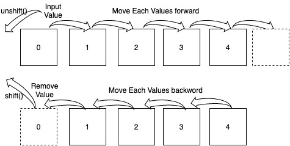

# js_summary07

## 배열

* type이 있는 언어에서는 배열과 같은 자료구조에서 동일한 type들만 담을 수 있다.

* js는 dynamically typed language이기 때문에 타입이 동적으로 정의가 되기 때문에 다양한 종류의 데이터를 담을 수 있다.`하지만 이러한 프로그래밍을 하는 것은 바람직하지 않다.`

### 배열 선언 방법

```js
const arr1 = new Array();
const arr2 = [];

const arr3 = [1,2,3,4]
```

1. `new Array()`를 통해 배열 생성

2. []를 통해 배열 생성

### 배열 길이

```js
const arr1 = [1,2,3];
console.log(arr1.length);
```

### 배열 반복 💬

단순 for문으로 돌리는 게 가장 기초지만, 가독성이 좋지 않기 때문에 가급적 피하자.

앞의 for...in 과 for...of 방법을 사용해도 된다.

#### forEach ⚠️💬

`forEach ( callbackfn: (value: T, index: number, array: T[]) => void, thisArg ? any : void);`

```js
const arr = [41, 25, 5];
arr.forEach(function(values, index, array) {
  console.log(values, index, array);
});
```

forEach를 사용할 때, 일반적으로 array는 받아오지 않는다.

**또한 위의 경우, `anonymous function`이기 때문에, `arrow function으로 표현이 가능`하다.**

**그리고 한줄만 실행하는 경우, js에서는 bracket또한 사용하지 않았다.**

아래와 같이 적용 가능하다.

```js
const arr = [41, 25, 5];
arr.forEach( (values, index) => console.log(values, index));
```

### 배열 데이터 삽입 / 호출

```js
const arr = [52,31,5,6];

arr.push(9);
arr.pop();
```

**그냥 아래 내용들은 참고만 하고, 필요할 때마다 MDN에서 찾아서 쓰도록 하자.**

`array.pop()` : remove an return an item from the end of the 'array'

`array.push(value)` : insert 'value' into the end of 'array'

`array.unshift(value1, value2)` : insert values into the beginning of the 'array'

`array.shift()` : remove and return an item from the front of the 'array'

`array.splice(start: number, deleteCount?: number, extra input values): string[]` : remove elements from designated index 'start' 'deleteCount' times<br>(→ ?는 optional. parameter　deleteCount는 지정해도, 지정하지 않아도 된다.), extra input values는 삭제된 인덱스 자리에 해당 value들을 입력한다. 

`array.concat(array2)` : add array2 elements to array

`array.indexOf(value)` : find the first index of the value

`array.lastIndexOf(value)` : find the last index of the value

`array.includes(value)` : find if the array includes the value → returns boolean

**shift, unshift는 pop이나 push에 비해 훨씬 느리다.️** ⚠️



배열에 아이템들이 들어있을 때, `뒤에서부터 넣고 빼는 것`은 빈 공간에 데이터를 넣었다가 지웠다가 하는 것이기 때문에 기존에 있던 데이터는 움직이지 않아도 되어서 `빠른 operation을 진행`할 수 있다.

하지만 shift / unshift의 경우, 배열 가장 앞 인덱스에 데이터를 추가하거나 삭제하기 때문에, 뒤 인덱스들이 한칸씩 다 움직여야 한다.

### 유용한 배열 함수들 정리(함수형 프로그래밍)

`arrays.reverse()` : 배열 순서를 뒤집음

`arrays.find(callbackfn)` : 콜백에서 정의한 결과 조건에 부합하는 것들 중 첫번 째 요소 리턴

`arrays.filter(callbackfn)` : 콜백에서 정의한 결과 조건에 부합하는 것들 모두 리턴

`arrays.map(callbackfn)` : 콜백에서 정의한 결과에 해당하는 값으로 변경한 후 리턴 ⚠️

`arrays.join(seperator)` : arrays의 요소들을 seperator로 나눠서 연결한 다음 String으로 리턴
