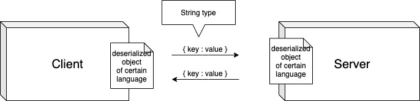

# js_summary08 ⚠️

## HTTP통신

Client, 서버간 하이퍼텍스트를 주고받기 위한 통신 규약(프로토콜)

## Ajax (Asynchronous JavaScript And XML)

웹 페이지에서 동적으로 서버에게 데이터를 주고받을 수 있는 기술

* XHR(`XMLHttpRequest`)

	`브라우저 API에서 제공하는 API중 하나`로 이 오브젝트를 이용하면, **서버에 간단하게 데이터를 요청하고 받아올 수 있다.**

	비동기 서버 요청의 초기 방식이다. 

	```js
	var xhr = new XMLHttpRequest();
	
	xhr.open('get', 'http://52.78.213.9:3000/messages');
	
	//track request status changes
	xhr.onreadystatechange = function() {
		if (xhr.readyState !== 4 ) return;
		//readyState: success
		
		if (xhr.status === 200) {
			console.log(xhr.responseText); //resopnse from server
		} else {
			console.log(`error : ${xhr.status}`); //error erupted when on request
		}
	}
	```

	XML을 사용해 통신을 할 경우, 불필요한 태그들이 너무 많이 들어가고, file의 사이즈가 커질 뿐 아니라,
	가독성도 좋지 않기 때문에 XML은 많이 사용되어지고 있지 않다.

	이러한 복잡한 코드를 줄이고 간편하게 사용하고자 해서 이후에 나온 것이 Ajax이다.

	> ### 비동기 방식 Ajax
	> 
	> 서버와 `자유롭게 통신`할 수 있다. → XMLHttpRequest(XHR)의 등장
	> 
	> 페이지 깜빡임 없이 `seamless하게 작동`한다 → JavaScript와 DOM 이용

* Fetch() API
	
	Fetch() API최근 브라우저 API에 추가된 fetch() API를 이용하면 간편하게 데이터를 주고받을 수 있다. `(IE 미지원)`


## XML

HTML과 같은 태그를 이용해 데이터를 나타내는 Mark-Up 언어

Ajax나 XHR의 X는 모두 XML을 뜻하는데, `서버와 데이터를 주고 받을 때는 XML만 가능할까?`

MS에서 AJax, XHR을 개발할 당시 서버:클라이언트간 데이터 송수신에 XML을 사용해서, 네이밍 시에 앞에 XML을 붙인 것 뿐

데이터를 주고받을 때는 XML 뿐 아니라 다양한 타입의 데이터를 주고 받을 수 있다. 요즘에는 `JSON`을 이용한 데이터 전송이 가장 많이 이용되고 있다.

## JSON (JavaScript Object Notation)

ECMAScript 3에서 나온 Object에 영감을 받아 만들어진 Data Format.

JSON은 JS의 `Object { Key : Value }` Key : Value 형식을 따른다.

* JSON 사용처
	* 브라우저, 모바일에서 서버와 데이터를 주고받을 떄
	* 서버와의 통신이 아닌, Object를 파일 시스템에 저장할 때
	* network와 network connection 사이에서 데이터의 전송과 `직렬화`에 사용된다.
	* `프로그램 언어나 플랫폼에 상관없이(독립적으로) 사용될 수 있다`
	
### 프로그램 언어나 플랫폼에 상관없이 사용된다⚠️

C, C#, Java, Python, PHP, Kotlin, Go ...

이 모든 언어에서 `JSON으로 직렬화된 데이터를 다시 언어의 특징에 맞게 Object로 변환`하거나, `다시 JSON으로 직렬화` 하는 기능을 지원해주거나, 외부 라이브러리에서 제공하고 있다.

## Serialization 직렬화

데이터를 요청하는 쪽이든, 받아서 처리하는 쪽이든 기존의 Object들을 String type의 직렬화된 JSON형식으로 바꾼 다음 데이터를 전송한다.
 
그리고 해당 데이터를 수신한 경우, deserialize해서 해당 언어(플랫폼)의 Object형식으로 받아 데이터를 처리한다.



### Object to JSON

그렇다면 js에서는 어떻게 Object를 JSON으로, JSON을 Object로 변경할까?

```js
//1. Object to JSON
// stringify(obj)
let json = JSON.stringify(true);
console.log(json);
```

```js
const rabbit = {
  name: 'tori',
  color: 'white',
  size: null,
  birthDate: new Date(),
  symbol: Symbol('id'),
  jump: () => {
    console.log(`${name} can jump!`);
  },
};

json = JSON.stringify(rabbit);
console.log(json);

json = JSON.stringify(rabbit, ['name', 'color']);
console.log(json);

json = JSON.stringify(rabbit, (key, value) => {
  console.log(`key: ${key}, value: ${value}`);
  return key === 'name' ? 'ellie' : value;
})
console.log(json);
```
⚠️
* `javascript에서 제공하는 특별한 데이터`인 `Symbol`의 경우 json에 포함되지 않는다.
* `jump에 해당하는 함수는 Object 내부에 포함되지 않은 데이터`이기 때문에 json에서는 제외된다. 
* stringify 대상의 `원하는 데이터만을 json으로 뽑아낼 수도 있다`.
* stringify 대상 Object의 `key, value 값을 받아서 커스텀 처리가 가능`하다. (위의 경우, key값이 name이면, ellie로 대체, 그 외 key에 대해서는 그냥 value를 반환하고 있다.)

### JSON to Object

```js
//2. JSON to Object

const rabbit = {
  name: 'tori',
  color: 'white',
  size: null,
  birthDate: new Date(),
  symbol: Symbol('id'),
  jump: () => {
    console.log(`${name} can jump!`);
  },
};

console.clear();
json = JSON.stringify(rabbit);
const obj = JSON.parse(json);
console.log(obj);
```
parse 함수를 통해 간단하게 JSON 데이터를 Object로 변환할 수 있다.

위 경우, JSON으로 데이터를 변환하고, 해당 데이터를 바탕으로 Object화 한 객체에는 jump, symbol 데이터가 들어있지 않기 때문에,
`json.jump();`를 하더라도 실행되지 않는다.


