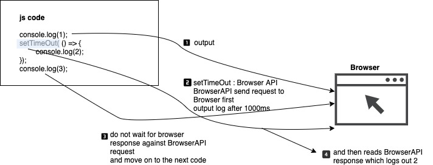

# js_summary09 ⚠️

## JavaScript is `synchronous` ⚠️

* `JavaScript is synchronous`.
* JavaScript `execute code blocks in order after hoisting`.

> `hoisting`
>
> Hoisting is a JavaScript mechanism where `variables` and `function declarations` are `moved to the top of their scope` before code execution

```js
console.log(1);
console.log(2);
console.log(3);

/**
 * 1
 * 2
 * 3
 * */
```

synchronous : 정해진 순서에 따라 코드가 실행되는 것

```js
console.log(1);
setTimeout(() => {
  console.log(2);
}, 1000);
console.log(3);
/**
 * 1
 * 3
 * 2
 * */
```



setTimeout 함수의 parameter로 전달한 함수는 callbackfn으로서 전달됨

## synchronous callback & asynchronous callback

### 1. synchronous callback
```js
console.log(1);
setTimeout(() => {
  console.log(2);
}, 1000);
console.log(3);

function printImmediately(print) {
  print();
}

printImmediately(() => console.log('print something'));
/**
 * 1
 * 3
 * print something
 * 2
 * */
```

1. function은 hoisting되어 코드 flow상 가장 상위로 이동
2. 1출력
3. Browser API에 1초후 callback 함수 실행하도록 요청
4. 3출력
5. function 실행
6. 1초 뒤 response인 callback function 실행 → 2 출력

### 2. asynchronous function

```js
console.log(1); //sync
setTimeout(() => console.log(2), 1000); //async
console.log(3); //sync

function printImmediately(print) {
  print(); //sync
}

printImmediately(() => console.log('print something'));
function printWithDelay(print, timeout) {
  setTimeout(print, timeout);
}

printWithDelay(() => console.log('async callback', 2000)); //async

/**
 * 1
 * 3
 * print something
 * 2
 * async callback
 * */
```

언어마다 callback을 지원하는 방식은 저마다 차이점이 존재한다. sub routine, lamda expression, function pointer등

## callback hell


   


